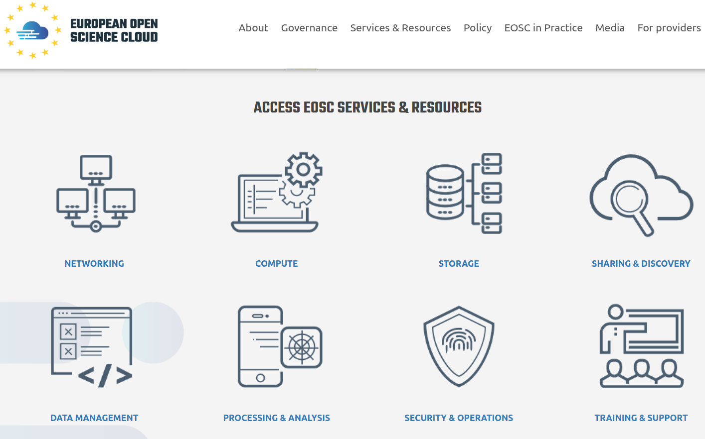
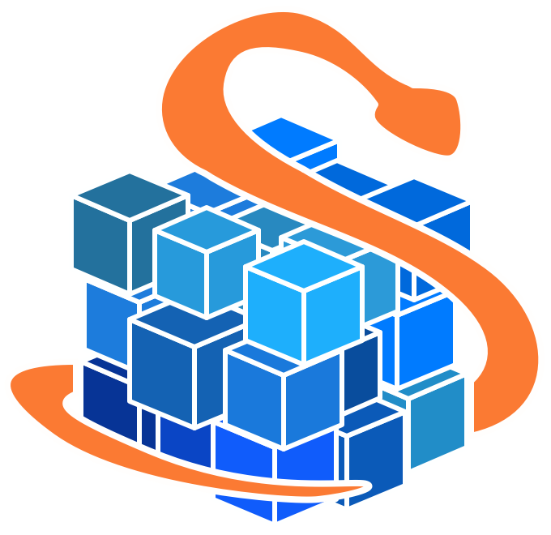

## Data Analysis and Sharing with the ENES Climate Analytics Service

**Sofiane Bendoukha**

German Climate Computing Center (DKRZ)

eScience 2019 15th International Conference

24-27 September, San Diego, USA

 
<small> EOSC-hub receives funding from the European Union's Horizon 2020 research and innovation programme under grant agreement No. 777536 </small>

---

## Agenda

* ECAS (presentation)
* Demo
* Hands on 
* Exercise
* Break 
* Data sharing with ECAS
* WPS (optional) 
* Wrap up

---

## Tutorial Materials

* Slides
https://statiksof.github.io/ECAS-EsCience-2019/

* Notebooks
https://github.com/ECAS-Lab/ecas-training/

---

## Useful Links

* ECASLab Web site 
https://ecaslab.dkrz.de

* Jupyterhub 
https://ecaslab.dkrz.de/jupyter/

* Ophidia user documentation
http://ophidia.cmcc.it/documentation/users/index.html

***

## **ENES Climate Analytics Service**

---

#### The European Open Science Cloud

https://eosc-portal.eu/

---

### EOSC-hub project 

 
* EC H2020 Project 
* Under the coordination of **EUDAT**, **EGI** and **INDIGO-DataCloud**
* The catalogue includes services in four broad areas: Common, Thematic, Collaborative and Federation.
* Training activities

<small> EOSC-hub receives funding from the European Union's Horizon 2020 research and innovation programme under grant agreement No. 777536 </small>

---

### Overview

* **ECAS** is part of **WP 7**: thematic services
  * ECAS enables scientific end-users to perform data analysis experiments 
* Server-based 
  * Computation **@ DKRZ** or **CMCC**
  * Avoid data transfer (download)
  * Improved reusability of data and workflows (FAIR approach)
* ECAS supports different Auth* providers 
  
  * Local and external providers supported (LDAP, B2ACCESS, EGI Check In)  
  * Additional AAI providers can be integrated on demand (e.g. GITHUB) 
  
---

#### Service Architecture and Interfaces

---

#### Data overview 

* ECAS provides data access via ESGF
* Coordinated Regional Climate Downscaling Experiment
  * ~ 100 Tbyte Cordex
* Coupled Model Intercomparison Project 5
  * ~ 1.2 Pbyte CMIP 5 data
* Coupled Model Intercomparison Project 6
  * ~ 250 Tbyte CMIP6 data from the 1PByte published
* Other data pools can be mounted on demand 
  * MPI Grand Ensemble (MPI-GE)
  * Data collection exposed in the Federated Data Archive (e.g. OneData) 

---

### Ophidia framework overview

[ophidia.cmcc.it](http://ophidia.cmcc.it)

* The Ophidia framework addresses big data chellenges for eScience
  * support for declarative, parralel, server-side data analysis exploiting parralel computing techniques 
  * end-to-end mechanisms tu support complex experiments and large processing workflows on scientific multi-dimensional cubes 
* Ophidia supports both **batch** and **interactive** data analytics 
  * More than 50 datacube-oriented **operators** are available, including: data reduction and subsetting, data intercomparison, metadata and provenance management, 
    time series analysis with array-based primitives
  * A wide set of (low-level) array-based primitives (over 100) to perform, e.g. data summerization, algebraic expressions, predicates evaluation, statistical analysis
  * Support for complex workflows ad Python applications execution 

---

#### Server-side paradigm and datacube abstraction in Ophidia

---

#### ECASLab 

---

#### Data sharing with ECAS

* Share your results with your team or with researchers from a broader community 
  * Post-processing datasets
  * Jupyter notebooks
* Cloud-based storage and sharing services integrated within ECAS
  * **B2DROP** online storage for external/internal collaborators. 
    Keep data synchronized and up-to-date  
  * **B2SHARE** store and publish research data from diverse contexts. Data assigned a **Persistent Identifiers** for better findability  
  * **DataHub (OneData)** a global data access solution for eScience 

 &nbsp;&nbsp;  &nbsp;&nbsp; 

***

***

## Demo

---

### Register/Log in and explore the Jupyter environment

---

### Notebooks

---

### Terminal 

---

### Hands on

 
* Open the following notebook: 
  **/notebooks/ECASLab-Training.ipynb**
* It provides step-by-step instructions on how to use the Ophidia operators as well as the PyOphidia library.
* After the completion you can try to run the other notebooks available under the /notebooks folder or proceed with the following exercise.

---

### Exercise

* Calculate the number of Summer days 
* Starting from the daily maximum temperature, the Summer Days index is the annual count of days number of days where TX (daily maximum temperature) > 25°C
* Based on the definition, try to calculate the number of Summer Days (you can start from the Tropical_Nights.ipynb notebook).
* Useful information: 
  * Input NetCDF:

    * E63_kp40_198001_199012_T2m_daymax_merged.nc

    * tasmax_day_CMCC-CESM_rcp85_r1i1p1_20960101-21001231.nc

  * 25°C: 298.15 Kelvin

***

## Stay in touch!

* Support
ecas-support@dkrz.de